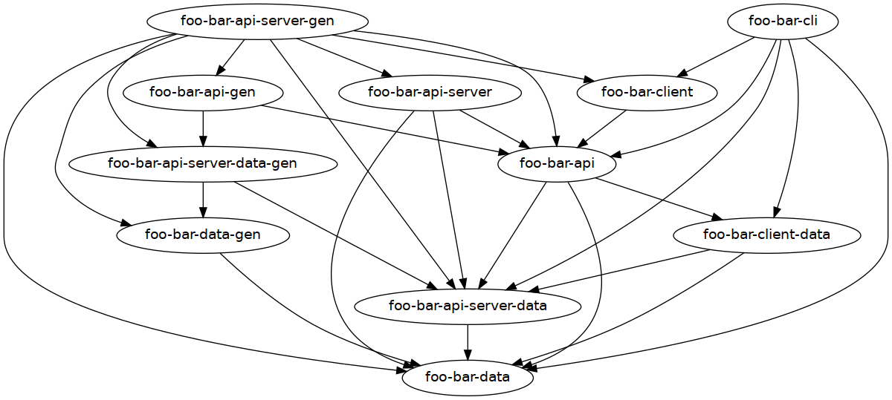

# Local-first application with sync server Template

This is a template implementation of command-line local-first application with a synchronisation server to go along with it.
It features complete option parsing, like in [template-optparse](https://github.com/NorfairKing/template-optparse), a command-line tool like in [template-cli](https://github.com/NorfairKing/template-cli), an api server like in [template-api-server-with-auth-and-cli](https://github.com/NorfairKing/template-api-server-with-auth-and-cli) as well as a full synchronisation implementation.
Both the server and the client use Sqlite to store the data that they synchronise.

* Haskell code for an API-server
* Haskell code for an accompanying command-line tool
* Haskell code for an implementation of synchronisation between those two.
  There types of synchronisation examples are implemented:
  * Append-only items
  * Immutable items
  * Mutable items with safe merge conflicts
* Database definitions for both the server and the client
* Per-route integration tests for the API server
* Per-command integration test for the CLI tool
* Option parsing & Option parsing tests for both the server and the CLI tool
* Stack build
* Nix build
* Cabal build
* NixOS module for hosting the server
* Nix home manager module for using the client with automated syncing
* Weeder check
* Test coverage report
* Flake-based CI
* Pre-commit hooks
  * ormolu
  * hlint
  * nixpkgs-fmt

## License

This template is **not** free to use.
See https://template.cs-syd.eu/template/NorfairKing/template-local-first-app-with-sync-server for more information.

Copyright (c) 2020-2023 Tom Sydney Kerckhove.

All Rights Reserved.

## Instructions

To use this template in a new project, choose the name for your project, for example `homeless-shelter`.
Then use [template-filler](https://github.com/NorfairKing/template-filler) to use the template, like this:

```
template-filler --source /path/to/this/template-local-first-app-with-sync-server --destination /path/to/your/homelessshelter --find FooBar --replace HomelessShelter
```

### Template overview

This template contains these haskell packages and notable modules:

- `foo-bar-data`: The data that is common across the server and the client.
  - `Foo.Bar.Data.Thing`: This is where the type to-be-synced is defined: `Thing`.
- `foo-bar-data-gen`: Generators and tests for those types
  - `Foo.Bar.Data.Thing.Gen`: The generator for `Thing`.
- `foo-bar-server-data`: The server-specific data types and database definition.
  - `Foo.Bar.Server.Data.DB`: The server database definition
- `foo-bar-server-data-gen`: Generators and tests for those types
- `foo-bar-client-data`: The client-specific data types and database definition.
  - `Foo.Bar.Client.Data.DB`: The client database definition
- `foo-bar-client-data-gen`: Generators and tests for those types
- `foo-bar-api`: The API, as a `servant`-based type definition, and related data types.
  - `Foo.Bar.API.Data`: The API data type definitions
  - `Foo.Bar.API`: The API Type definition
- `foo-bar-api-gen`: The generators and tests for the API and its data types.
  - `FooBar.API.Data.Gen`: Generators for the API data types
- `foo-bar-api-server`: The API server that implements this API.
  - `Foo.Bar.API.Server.OptParse`: Option parsing
  - `Foo.Bar.API.Server.Env`: The (read-only) environment and related functions
  - `Foo.Bar.API.Server.Handler.<CommandName>`: One module per command of the CLI.
- `foo-bar-api-server-gen`: The generators and tests for the API server.
  - `Foo.Bar.API.Server.TestUtils`: Utility functions to write tests that use the API server
  - `Foo.Bar.API.Server.Handler.<CommandName>Spec`: One module per handler containing its tests
  - `Foo.Bar.API.Server.Handler.Sync`: The server-side implementation of synchronisation.
- `foo-bar-client`: The client record of functions to call the API server.
  - The `Foo.Bar.Client.foo-barClient` record.
- `foo-bar-cli`: An example command-line tool to call the API server.
  - `Foo.Bar.CLI.OptParse`: Option parsing
  - `Foo.Bar.CLI.Env`: The (read-only) environment and related functions
  - `Foo.Bar.CLI.Command.<CommandName>`: One module per command of the CLI.
  - `Foo.Bar.CLI.Command.Sync`: The client-side implementation of synchronisation.



### Synchronisation examples

This template features three types of synchronisation:

* Append-only items via [`appendful`](https://github.com/NorfairKing/appendful)
* Immutable items via [`mergeless`](https://github.com/NorfairKing/mergeless)
* Mutable items with safe merge conflicts via [`mergeful`](https://github.com/NorfairKing/mergeful)

There is one example for each. Find the details here:

* The request and response type definitions in `Foo.Bar.API.Data`
* The server implementation in `Foo.Bar.API.Server.Handler.Sync`
* The client implementation in `Foo.Bar.CLI.Commands.Sync`

You can delete whichever of these you do not need, and use the others.

### OptParse

The option parsing for both `foo-bar-cli` and `foo-bar-api-server` is based on [the option parsing template](https://github.com/NorfairKing/template-optparse).
It is included in this template so you will not need to also buy the option parsing template.

For more information about how to use the option parsing, follow the instructions in `template-cli/src/Foo/Bar/Cli/OptParse.hs`.

### Nix build

If you don't need a nix build, remove these files:

```
rm -rf *.nix nix .github/workflows/nix.yaml
```

In `nix/pkgs.nix` we define our own 'version' of the `nixpkgs` by adding our own overlays.
The project overlay is defined in `nix/overlay.nix`.

In `nix/nixos-module.nix`, we define a nixos module for hosting the sync server.
In `nix/home-manager-module.nix`, we define a nix home manager module for using the project on NixOS with automatic syncing.
In `nix/nixos-module-test.nix`, both of those are tested. This test is not run on CI because GitHub actions does not support it.

See the instructions in `nix/overlay.nix` for more details.

### CI

CI is set up for both a stack build and a nix build.
See `.github/workflows` for more details.

The stack build should "just work".

For the nix build to work, there is a manual step that you need to go through:
First, make a cachix cache at cachix.org.
Put its name in the right places within `.github/workflows/nix.yaml`.
Then put its signing key in the 'Secrets' part of your repository on github.

### Workflow examples

#### Adding an endpoint to the API

1. Add the endpoint in `foo-bar-api/src/Foo/Bar/API.hs`.
2. Add a handler module in `foo-bar-api-server/src/Foo/Bar/API/Server/Handler/<RouteName>hs` with a function as follows:

   ```
   handle<RouteName> :: H ()
   ```

   Give it a type according to the endpoint type.
   If it requires authentication, add `AuthCookie` as the first argument.

3. Hook up the handler in the `foo-barHandlers` record in `foo-bar-api-server/src/Foo/Bar/API/Server.hs`.

   If the endpoint requires authentication, use the `protected` combinator.

4. Add tests in `foo-bar-api-server-gen/test/Foo/Bar/API/Server/Handler/<RouteName>Spec.hs`

#### Adding a command to the CLI tool

1. Add the new command's option parsing in the `Foo.Bar.CLI.OptParse` module according to the instructions within.

2. Add a `Foo.Bar.CLI.Command.<CommandName>` module with a function as follows:

   ```
   commandName :: CommandNameSettings -> C ()
   ```

3. Add a case to the `dispatch` function in `Foo.Bar.CLI`.
4. Add tests in `Foo.Bar.CLI.Command.<CommandName>Spec`.

#### Adding a new table to sync

To add another piece to synchronise on, first you need to make the following design decision to figure out which syncing library to use:

1. Should it be possible to modify the items? If so, use [mergeful](https://github.com/NorfairKing/mergeful) like the `ServerAppendfulThing` example.
2. If not, should it be possible to delete the items? If so, use [mergeless](https://github.com/NorfairKing/mergeless) like the `ServerMergelessThing` example.
3. If not, the data is add-only, so use [appendful](https://github.com/NorfairKing/appendful) like the `ServerMergefulThing` example.

Then  make the following changes:

1. Add a data type for the thing you want to sync, like in `foo-bar-data/src/Foo/Bar/Data/Thing.hs`.
2. Add a declaration of a table on the server side for it, in `foo-bar-api-server-data/src/Foo/Bar/API/Server/Data/DB.hs`.
   This table will likely have a `user` column, to separate the syncing per server.
   When using `mergeful`, you will also need a `serverTime :: ServerTime` field, to represent the version number on the server side.
3. Add a declaration of a table on the client side for it, in `foo-bar-client-data/src/Foo/Bar/Client/Data/DB.hs`.
   This table will have to have extra fields, on top of the data of the `Thing`, depending on which library you use.
   In any case, you will need a `serverId :: Maybe ServerThingId` field, to represent that the thing has been synced.
   When using `mergeful`, you will also need these fields:
   * `deletedLocally :: Bool`, to represent that the thing has been deleted locally but that that deletion has not been synced.
   * `modifiedLocally :: Bool`, to represent that the thing has been changed locally but that that modification has not been synced.
   * `serverTime :: Bool`, to represent the synced version number
4. Change the `SyncRequest` and `SyncResponse` type in `foo-bar-api/src/Foo/Bar/API/Data.hs` to include a field for syncing the new type.
   When syncing multiple things, these types can just contain one field for each type of thing to sync.
5. Implement the server-side of the synchronisation in `foo-bar-api-server/src/Foo/Bar/API/Server/Handler/Sync.hs` following the documentation in your chosen synchronisation library.
   Because we use persistent to store the things, you can probably use the `-persistent` version of the synchronisation library.
6. Implement the client-side of the synchronisation in `foo-bar-cli/src/Foo/Bar/CLI/Commands/Sync.hs` following the documentation in your chosen synchronisation library.
